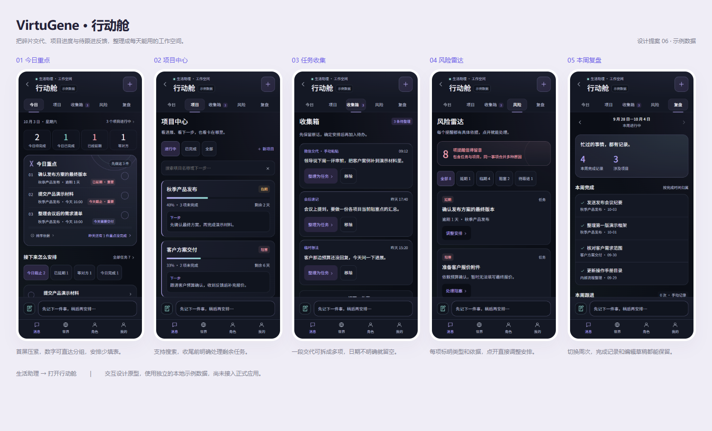
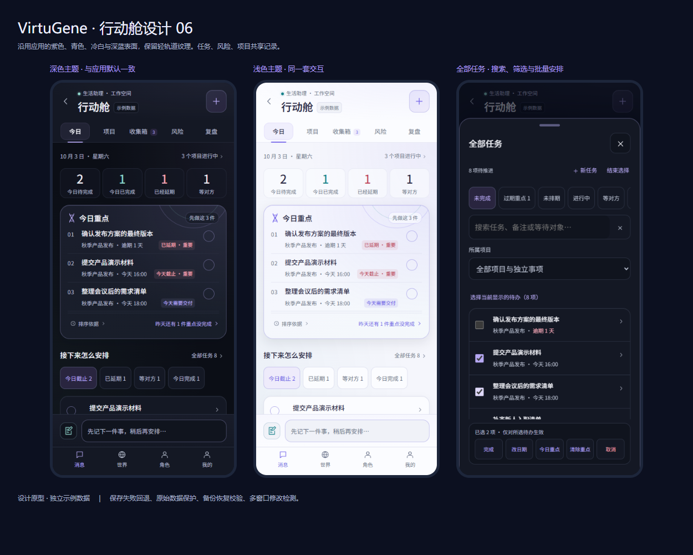
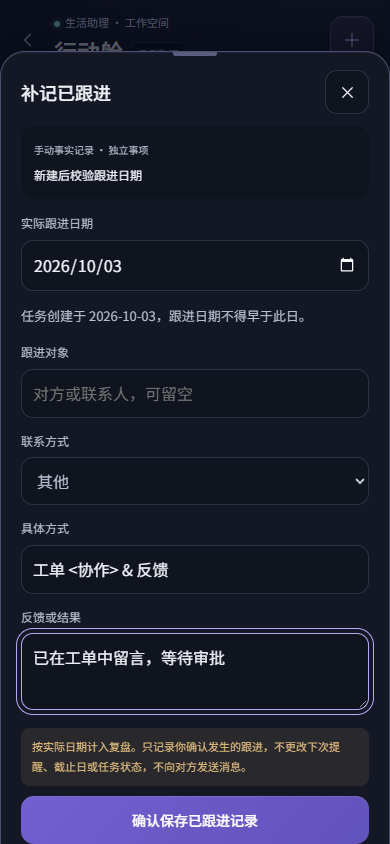
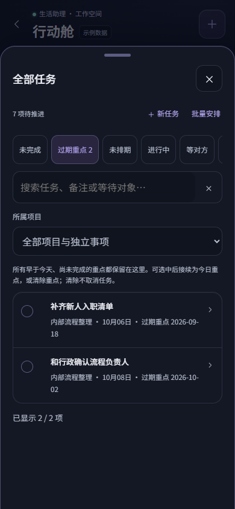
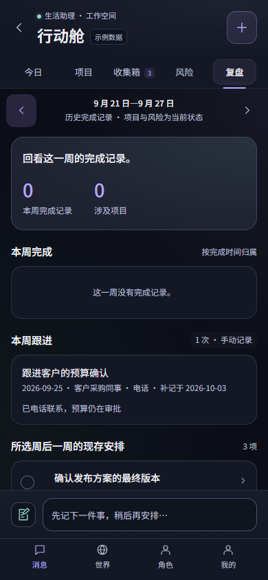
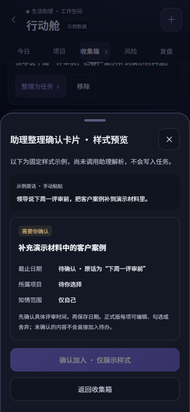
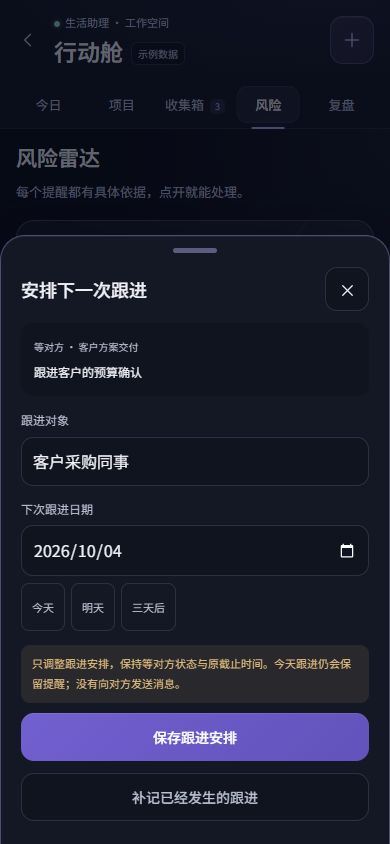

# 行动舱 · 设计提案 06

状态：此文保留完整设计契约与独立五页原型，示例日期固定为 2026-10-03。2026-10-04 正式应用已接入第一阶段的“今日 + 手工收集箱”，实现与验收边界见 [第一阶段接入记录](ACTION-CABIN-IMPLEMENTATION-2026-10-04.md)。其他原型页面尚未开放。

预览：[可点击原型](prototypes/workbench.html)。原型仅保存独立的本地演示数据，可重置；不读取或修改应用数据库，也不调用 AI。页面内“示例数据”始终可见。

## 第六版：跟进有历史，过期重点有归宿（2026-10-04）

定稿收尾：常用跟进方式保持稳定枚举，选择“其他”时填写最多 40 字的具体方式（methodDetail），历史“其他”记录缺少此字段仍可读取。实际发生日不得早于已知任务创建日期；新任务保留 createdDate，记录时保留 taskCreatedDate 快照，表单、业务提交和恢复校验保持一致。历史任务缺少创建日期时显示未知，不以等待开始日、截止日或迁移日猜测创建日。原型仍是独立示例；正式版按下文的真实时区与来源约束执行。

本轮依据复评补齐原型与正式开发契约，尚未接入 App 数据。原型依然固定在 2026-10-03，因此样例 t11 的 10 月 2 日重点在演示时钟下仍是昨日；真正的缺口是更早日期没有可查入口，此次不通过移动样例日期掩盖它。

- 全部任务新增“过期重点”筛选，覆盖所有早于今天且未完成的重点，不设 N 天隐藏窗口；显示原重点日期。可批量接续为今日重点或清除重点，清除不取消任务，支持撤销。完成/取消事项不进入该筛选，普通编辑保留过期重点。
- “安排下一次跟进”记录安排变更事件，包括清除原跟进日；字段不变时不新增事件。它仍然不是已联系对方的证据。
- 新增“补记已跟进”：从快捷跟进面板或活动任务编辑进入，选择实际日期（今天及以前）、联系人、联系方式与真实反馈。记录填写日期和实际日期，保持原截止日、下次提醒、工作状态和等待开始时间；失败保留输入并回滚，成功可撤销。
- 复盘新增“本周跟进”，按实际发生日归属，补记的填写日单独标注；安排变更折叠展示，完成数只读完成事件。任务后续改名不会改写历史跟进标题和联系人，草稿包含两类明确区分的记录。
- 备份升级为 v4，读取 v3 或此前裸数据时，缺少 kind 的旧事件仅解释为完成事件；未知类型或非法跟进字段拒绝恢复，不推测旧任务“已经联系过谁”。
- 收集箱可打开“助理整理确认卡片”只读样式稿，呈现原话、候选事项、未确定日期、项目和默认私密。确认按钮禁用且明确未调用解析、不写数据；正式的可编辑确认流程仍属第三阶段。
- 清理不再使用的 assistant-avatar 样式，保留已有 DNA、轨道与触控实现，并复跑其检查。

## 第五版：更紧凑的首屏，更稳定的操作（2026-10-04）

本轮继续优化可点击原型，正式应用接入仍按下文的“今日”垂直切片推进。预览日期继续固定为 2026-10-03，确保演示案例和验证可以复现；不是用户当前的真实安排。

- 今日重点收紧行间距，将排序依据与昨日重点接续放在卡片底部同一行。保留三件重点、截止原因和 44px 以上完成/接续触点；390×844 预览首屏能看到后续任务的第一行，不再让昨日提示单独占一整块。
- 等对方的风险事项新增“安排跟进”：只填写跟进对象和下次日期，可选今天、明天、三天后；仍可打开完整编辑。今天的跟进继续保留提醒，未来跟进按约定日期提示；截止日、等待开始日、任务状态保持原样，没有向对方发送消息。保存后可撤销，失败保留表单并回滚数据。
- 从全部任务进入编辑，保存或关闭后返回同一列表，保留筛选、批量选择、已加载数量和滚动位置，键盘焦点回到原任务；事项不再符合筛选时不强行展示。勾选任务时更新数量不会把长列表滚回顶部。
- 普通编辑保留已过期的重点日期，避免修改标题或备注时意外消除昨日提示；显式取消今天的重点仍立即生效。跨日接续仍须用户确认，不自动续期。
- 全部任务同档排序补齐具体截止时间，与今日重点的日期/时间排序保持一致，再按稳定标识排序；原型仍未接入正式重复实例和真实数据库。

## 第四版：评审意见落实（2026-10-03）

新页面定名 **行动舱**：延续 VirtuGene 的轨道和空间意象，含义是管理现实中的行动安排。页签仍叫“今日 / 项目 / 收集箱 / 风险 / 复盘”，不把任务、项目替换成难懂的世界术语。现有首页卡片的 `aria-label="生活助理工作台"` 保持原功能；它是概览入口，“打开行动舱”才进入新页面，名称不再碰撞。

| 评审问题 | 本次处理 | 验证范围 |
| --- | --- | --- |
| 两个工作台入口撞名 | 新页面、入口按钮、无障碍名称、效果图统一为行动舱 | 原型可查看 |
| 重复任务统计口径缺失 | 下文规定以发生实例计数、完成、延期、重点和等对方 | 正式开发硬约束，原型尚未接入重复任务 |
| 任务编辑规则容易漂移 | 正式版抽取既有 TodoEditor；规则集中到 todo-repo | 正式开发硬约束 |
| 等待同时指向用户与对方 | 行动舱工作状态叫“等对方”，助理补充请求叫“待你补充” | 原型只修改前者，不修改 pendingContext |
| 速记头像暗示调用助理 | 改为笔记图标，标明手动速记并保存到收集箱 | 原型可操作，无模型调用 |
| 项目与角色授权关系不明确 | 默认私密，项目和任务授权取交集；先过滤再生成角色摘要 | 正式开发硬约束 |
| 五页同时上线扩大数据风险 | 第一阶段仅“今日”接真实数据，通过迁移与同步验收再展开 | 分阶段落地门槛 |

补充交互：昨日未完成重点出现“昨天还有 N 件重点没完成”。点开后逐项选择，明确确认才将重点日期移到今日，可撤销；不会调整截止日期、改变等对方/阻塞状态或覆盖原排序。全部任务每次显示 100 项，可继续加载，不再让第 101 项以后只能靠搜索找到。加载更多保留筛选、已选事项和滚动位置；搜索或筛选变化时清空选择并回到首批。

## 主题与可靠性

视觉直接沿用项目的 [`mobile-soul.css`](../src/styles/mobile-soul.css)、[`secretary-ui.css`](../src/styles/secretary-ui.css) 与 [`theme-store.ts`](../src/store/theme-store.ts)：应用默认深色，背景 `#0c1020`、面板 `#151b2d`，浅色背景 `#f5f6fc`、面板 `#fbfcff`；紫色负责选中与主操作，青色负责完成与助理在线提示。轨道细线只出现在重点区域，主体使用轻边框、分层表面与稳定列表，不添加持续运动的背景。

原型新增明暗切换以方便评审，设置独立保存；正式版应继承应用全局主题。明暗切换不会重置任务、筛选或编辑，页面和底部面板均有对应表面色；主要输入和操作统一到 48px，表单字号为 16px。批量面板的列表独立滚动，操作栏始终可见，选取任务时不再同时展示另一个“完成”勾选控件。

功能补强：

- 首页进入“全部任务”，找到未排期及当前首页没有展示的任务，支持状态、项目、标题、备注、等待对象组合筛选。
- 可在全部任务面板新建或编辑任务，保存后返回同一视图。批量完成、改日期、今日重点与取消只作用于所选未完成任务；改变搜索或筛选会清空选择，避免误操作隐藏事项。
- 批量修改统一提交、统一撤销，完成时每项只新增一条完成事件；改日期保留已有时间，取消不作为已完成成果。取消前先列出事项确认。
- 时间风险细化到分钟。入口预览可修改固定日期下的演示时间；16:00 截止的任务在 16:01 显示延期。首页、重点与风险共用同一判断。
- 项目中的未完成阻塞任务会派生项目阻塞状态，明确的项目阻塞标记仍然保留；完成/解除对应任务后，派生阻塞同步变化。
- 示例数据支持导出 JSON 备份和校验恢复。导入限制 10 MB，检查记录形状、合法日历日期、状态、优先级、唯一标识、项目关联及复盘草稿；非法数据不进入确认步骤，合法数据列出数量后确认替换，支持撤销。

可靠性边界：

- 写入失败不会显示成功，任务/项目/收集项/批量处理回到修改前数据，当前表单保持打开以便重试。复盘未保存的文字留在编辑框并提示复制或重试。
- 遇到异常存储时暂时显示初始样例，原始字节留在原存储位置，暂停写入。可导出原始备份，只有明确选择重置或恢复后才替换。
- 写入前检查已保存版本，并监听其他窗口更新；检测到变化后暂停旧窗口写入，不自动合并或覆盖。重新载入前提示保留未保存输入。此处是原型的冲突检测，正式应用仍需数据库事务和同步版本处理，不能作为同时写入的事务保证。
- 恢复时清除旧筛选，避免恢复后的数据因无效项目筛选而看似消失；异步读取备份时若已关闭面板或选择另一文件，会忽略过时结果。
- 原型只处理独立的演示数据，不代表真实应用的数据同步、提醒、重复任务或 AI 解析已经实现。

## 本轮优化

| 日常使用中的问题 | 行动舱的处理 |
| --- | --- |
| 首屏看完三件重点，后续操作还在下面 | 压紧重点区，将入选原因与截止说明放在同一行；首屏提供任务分组与全部任务入口，有昨日重点时就近提示，统计数字也能直达相应分组 |
| 简单任务也要面对一整页表单 | 日期支持今天/明天/周一/暂不设置；只有等对方时展开跟进字段；阻塞时展开原因；备注与来源按需打开 |
| 一段交代包含多项工作 | 可手动拆成多个候选任务，显示待加入清单再确认，每项保留原话与来源；日期不确定就留空 |
| 项目结束时仍有待办 | 收尾面板列出剩余任务，选择保留为独立事项、迁移到其他进行中项目或取消；确认前不修改数据，确认后支持撤销 |
| 上次写好的复盘再次打开消失 | 按周保存编辑草稿；记录变化时保留编辑并提示，重新生成前确认覆盖 |
| 重新打开任务，过去的完成经历被抹去 | 完成事件与当前状态分开；周复盘保留完成记录，同时标注“当前已重新打开” |
| 项目多时不好找，初次使用无从下手 | 项目支持搜索名称与下一步；无任务显示暂无进度；空行动舱提供速记与创建项目入口 |

原型同时补齐了助理卡片入口和返回路径，保留当前行动舱页签；键盘方向键可切换页签，打开面板后背景不再接收焦点。手机上可从入口预览选择“查看空白状态”或“重置演示数据”。

## 目标与入口

行动舱首先回答三个问题：今天先做什么、哪里需要处理风险、这周完成了什么。保留 VirtuGene 的紫色、青色、圆角和轨道细线，以清晰列表为主；助理头像只用于真实助理入口，手动速记使用笔记图标。

建议在现有“生活助理”卡片提供两个明确入口：“和助理聊聊”“打开行动舱”。行动舱是助理下的二级页面，主导航继续保留消息、世界、角色、我的。原型已演示卡片入口与返回路径；聊天按钮展示其与现有对话的关系，尚未连接真实聊天。

采用五个内部页签：今日 / 项目 / 收集箱 / 风险 / 复盘。收集箱是尚未安排的原始事项，避免与已有“办事收件箱”（执行结果、草稿、待补充请求）混淆。

底部常驻速记入口，允许先记原话，之后再安排；右上角加号直接新建结构化任务。原型支持手动整理与拆分多项任务；正式版可在助理聊天中解析自然语言，再展示字段和确认卡片。未确定的日期、负责人和所属项目留空，不猜测。

## 五个页面

| 页面 | 首屏重点 | 可执行操作 |
| --- | --- | --- |
| 今日 | 日期、进行中项目数、今日待办/完成/延期/等对方四个数字；最重要的三件事及入选原因 | 完成与撤销、查看排序依据、编辑任务；按今日截止/延期/等对方/今日完成筛选；接续昨日重点；打开项目 |
| 项目 | 名称、真实进度、剩余天数、未完成任务数、下一步和风险标签 | 创建、编辑、筛选项目；在详情查看和新增关联任务 |
| 收集箱 | 交代的原话、来源、收集时间 | 速记；整理为任务，补全安排；移除与撤销 |
| 风险 | 有依据的风险总数、分类筛选和每件事项的具体原因 | 修改日期、处理阻塞、安排跟进；直接打开相关任务或项目 |
| 复盘 | 本周实际完成、涉及项目、本周记录、当前风险与下周已有安排 | 查看记录、生成可编辑草稿、复制；生成文本前确认记录范围 |

首页用一块深紫区域突出三件重点，其他内容使用白色列表和轻边框。风险只用红色/琥珀色表达有依据的提醒；完成用青色。项目进度不占据首页主要位置。

任务详情用底部面板，保留标题、项目、截止日期与时间、优先级、工作状态、今日重点、等待对象、跟进日期、备注/阻塞原因、原始来源。输入和主要按钮不小于 44px；320px 手机也不出现横向溢出。常规过渡约 180–220ms，遵从减少动态效果设置。

## 排序与统计规则

今日重点仅取未完成、可推进的任务；等对方与阻塞单独提示，避免每天推荐无法开工的事项。最多展示三项，不足时显示实际数量。

1. 已延期的重要/紧急任务。
2. 今天截止的重要/紧急任务。
3. 今天截止的普通任务。
4. 手动标记的今日重点。
5. 其余任务按截止时间排序，无截止时间排后。

同一档按截止日期、时间排序，再使用稳定顺序，避免刷新时跳动。每条标明“已延期 · 重要”等原因。原型已使用 `focusDate` 表示“今日重点”，只匹配当日；演示时钟仍固定，不模拟跨天。

今日待办：今天截止且未完成的发生实例，包含等对方和阻塞。今日完成：完成时间落在今天的发生实例，即使其原定截止日不是今天也计入。延期：截止时间已过且未完成的实例。等对方：工作状态为 waiting 的未完成实例，不等同于全部触发风险。项目数按项目实体计数，与任务实例数分开。

原型有具体截止时间时，按固定演示日期与用户调整的演示时间判断风险，精度为分钟；无时间的日期截止按当天结束判断。正式版按用户时区的真实日期和时间计算，处理跨天、切回前台和时钟变化。

## 项目与风险

项目字段：名称、说明、开始/截止日期、优先级、下一步动作、状态、备注；进度取关联有效任务的完成数 / 总数。没有任务时显示暂无进度，隐藏进度条。取消和删除的任务不进入分母。

项目完成由用户明确确认，任务进度 100% 不自动关闭项目。提前确认完成但仍有待办时，原型已列出剩余任务并要求选择保留、迁移或取消；未确认不会改动项目和任务，确认后可撤销。取消的事项可在项目详情展开查看，不算完成成果。重新打开已收尾项目中的任务，会明确说明项目也将重新打开；通过任务编辑改变状态时，表单同样提示这一联动。阻塞是明确的工作状态；临期与延期是日期派生的风险，可同时存在。

风险规则：

- 延期：已超过截止时间且未完成。
- 临期：今天起未来 3 个自然日内截止，且未完成。
- 阻塞：用户明确标记，并能查看阻塞原因。
- 等对方：优先遵循跟进日期；未设置跟进日期时，连续等待满 3 天提示。用户设了未来跟进日期时，不因等待天数提前告警。

同一任务有多个风险时合并为一行，多标签保留。项目和任务是不同事项，原型总数明确标为“包含任务与项目”；正式版可按项目展开聚合，不把该数称作“风险任务数”。完成/取消/删除后从活动风险中移除。风险提醒只建议跟进，不表示已联系他人。

## 收集与复盘的边界

微信交代只能通过手动粘贴或已有授权来源进入，不暗示自动读取微信。一次交代可能包含多个任务，正式版助理解析后展示候选列表，用户确认后才写入；始终保留原话及来源。日期含糊时需要补充，不直接套用默认日期。

周归属取完成时间，与截止日期分开。复盘的“本周完成”是历史事件，“项目进展”“待处理风险”是当前快照，要明确区分。正式版应记录状态变更和每次完成/重新打开事件，才能稳定查询往周记录；循环任务按各次发生实例记录完成，不能让修改模板改变过去成果。

原型默认显示 9/28–10/4，支持向前查看最多 12 周，按完成事件筛选记录；没有事件的周显示空状态。完成事件保留当时的标题与项目名称，之后改名、迁移、删除或重新打开不会改变事件；撤销一次完成会同时撤销该次事件。原型仅有单次任务，同一任务在同一周多次完成只计一项，复盘标注当前是否重新打开；正式版按下文的发生实例身份去重。

原型草稿按周存储，可刷新后继续编辑；源记录变化时提示草稿可能过时并保留用户文本。重新生成会确认覆盖，复制使用最终编辑内容。历史周的项目状态和风险明确标注为“当前”，不伪造历史快照；后一周安排也注明是当前保留的安排。未调用模型、没有历史任务数据时不补造成果。正式版助理只能依据选定真实记录润色，不自动发送周报。

## 与现有能力的衔接（待正式开发）

现有事实：应用已有 `Todo`、优先级、日期/时间、重复与提醒设置、来源和可见性；生活助理卡片已经汇总待办及执行请求。目前没有项目实体，也没有完整的行动舱五页。`SecretaryTask` 表示助理执行请求，不应当作项目任务复用。

复用现有 `Todo`、`TodoOccurrence` 和提醒服务，不建立另一份待办清单。保留 Todo 生命周期 `todo/completed/cancelled/deleted` 和 occurrence 生命周期 `todo/completed/skipped/cancelled`；另加工作状态 `workStatus: todo/doing/waiting/blocked`。`projectId` 是模板的项目归属，`focusDate` 是单次实例的重点日期；等对方、等待开始时间、等待对象、跟进日期和阻塞原因作用于单次实例。需要为未来实例设默认工作状态时放在模板，实例有覆盖值时优先使用覆盖值。完成时间与变更事件用于复盘。项目单独建实体；原始收集项保留来源引用。

查询遵守现有用户归属和可见性，助理只能访问授权记录。真正删除遵循现有软删除与同步策略；原型的数组删除仅作交互演示。迁移保持现有待办、提醒和重复规则可用。

正式开发遵守以下数据约束和分阶段验收；本轮修改设计原型与落地契约，没有将五页接入应用。自然语言定制行动舱作为后续能力，先限定为模块显隐、顺序、默认筛选等配置。

### 发生实例是统计和操作单位（硬约束）

复用 [`todo-repo.ts`](../src/db/todo-repo.ts) 的 `expandOccurrenceDates`、`occurrenceId`、`localDateKey` 与 `addLocalDays`。今日页不能通过 `Todo.status` 推断某次重复任务是否完成，也不能另写一份周/月重复算法。先按共享规则展开查询日期，再按实例标识合并 `TodoOccurrence` 的实际状态、时间和工作字段，忽略已删除/已取消模板以及 skipped/cancelled 实例。

- 实例身份沿用 `todo-occ:${todoId}:${scheduledDate}`，渲染和操作携带 occurrenceId；推迟某次截止时间保留该身份及原计划日期，不能通过改截止日期生成第二个实例。缺少覆盖才继承模板值，显式清空用可同步的空值表达，不能把“清空”当成“未设置”。
- 完成/重新打开沿用 `todoRepo.complete/reopen` 的实例语义；单次任务兼容同步模板状态，重复模板不因完成一次而永久完成。新增工作字段、完成事件和提醒失效/重建在 repo 的事务及一致性流程中处理，不由页面分别写库。
- 今日重点与昨日接续只修改所选实例的 focusDate；不自动让每天新发生的实例继承昨日重点。某次等对方/阻塞不能使未来所有重复实例都进入相同状态。
- 完成数按 occurrenceId 去重；同一个模板本周两个日期各完成一次计两项，同一实例反复完成不重复计算成果。历史事件保留当时标题、项目和发生日期，修改模板不重写历史。
- 延期查询必须合并仍未完成的旧实例及当前计划产生的应发生实例，不能只查今天，不能只查已经物化的记录。对长历史按日期批次展开并以游标继续；不得用固定回看天数静默漏掉旧延期。原型的固定时钟与普通任务数组不验证这条。
- 未排期哨兵 `9999-12-31` 不参与日期风险。正式实现先统一既有未排期完成路径，避免按今日完成后仍展示一个未完成哨兵实例；两种入口必须得到同一结果。

首次接入的实例回填从原计划起点分批进行，已有实例状态、完成时间和稳定标识优先保留；禁止回填覆盖已完成记录。验收覆盖跨年每周、多个星期、每隔 N 周、月底与闰日、已过今日提醒时间、单次改期、取消/跳过、重复完成及午夜切换。发现既有重复规则问题先在共享 repo 修复再接入行动舱，不在新页面补分支掩盖。

### 编辑与规则只保留一份（硬约束）

正式版从 [`TodoPage.tsx`](../src/components/todo/TodoPage.tsx) 抽取当前内部 `TodoEditor` 为共享组件，两处调用。日期校验、重复锚点、星期/月日计算、工作字段覆盖、提醒重建和可见性校验收敛到 todo-repo 及其共享规则模块；页面只负责表单输入和明确选择“仅这一次 / 后续安排”。仅改标题、备注、重点不重新锚定重复规则；用户改变重复计划时才按明确生效日期调整未来安排。

原型的 editTask 是独立示例交互，不作为正式版的第二个编辑器迁入。原型“重要/紧急”到应用 `important/urgent` 的文案映射也应在共享组件统一，不改变既有优先级枚举。助理的 `pendingContext` 仍表示“待你补充”；新工作状态 waiting 表示“等对方”，不参与助理执行请求的状态流转。

### 项目与角色的关系（硬约束）

行动舱管理用户的现实事项，默认只有用户看见；差异化来自用户可选择让角色理解当前目标、阻塞和成果，而非自动把私人事务写进世界或替用户对外联系。每个新项目默认 `visibility='private'`，可改为 selected 并指定 visibleTo；不提供世界公开项目。助理身份也不是读取全部私密内容的授权。

| 场景 | 角色可知道的范围 |
| --- | --- |
| 项目、任务都私密 | 不进入角色召回、消息上下文或世界事件 |
| 只授权项目 | 可见授权项目自身信息；不包含未授权任务的标题、数量、比例、风险、等待对象或由其派生的下一步 |
| 只授权任务 | 可见任务，但其私密项目名称、描述、备注、项目关联摘要不外露；显示为独立事项 |
| 项目和任务都授权当前角色 | 可见两者，并仅基于授权任务计算角色视角的进度、风险和成果 |
| 多角色对话 | 必须对在场每一个角色均可见，空 audience 不返回任何事项 |

复用 [`visibility.ts`](../src/lib/world/visibility.ts) 的可见性闸门与既有 todoRepo 的授权查询；模板是实例授权来源，项目是项目字段授权来源，两者取交集决定关联信息。用户自己的行动舱可以查看完整数据，角色摘要则必须先过滤再聚合，不发送完整进度或隐藏任务总数；角色参与、负责某事项均不自动扩大 visibleTo。

历史事件与草稿的来源引用保留用户归属和源修订；角色读取历史成果时重新检查当前授权。撤销分享、删除、取消后沿用 [`memory-source-tombstone-repo`](../src/db/memory-source-tombstone-repo.ts) 的失效链路，不能通过历史标题或旧摘要继续召回。用户在助理聊天中明确选定私密来源用于整理，仅授权此次请求所需内容，不永久改变知情范围。主动角色关心需用户显式开启，发送仍走现有确认链路。

### 跟进事件化（第一阶段动工前确定的契约）

**事实与计划分开。** 用户修改下次跟进日期或对象，生成 followup-planned；用户明确确认曾联系过对方，生成 followup-recorded。修改日历、等待满三天、模型说“建议跟进”、提醒到期或请求排队，均不能生成 followup-recorded。用户补记属于手动事实来源，界面标注“手动记录”，不声称有外部消息投递证据。清除下次提醒保留安排变更事件；字段没有变化不生成新事件。

正式版使用带类型的事务事件表，先确定形状再上线；原型只是 events 数组，不代表这些字段已迁入 Dexie：

| 字段组 | 正式版契约 |
| --- | --- |
| 稳定身份 | id、userId、todoId、occurrenceId；实例仍按原计划日期定位，单次改期不换身份。项目可为空 |
| 类型与来源 | kind 为 completed / followup-planned / followup-recorded；source 为 user-confirmed，actor 明确当前用户。助理不能通过自称确认生成事实 |
| 日期 | occurredDate 为实际发生的本地日期，保留 timezone；recordedAt 为真实写入时间。用户只知道日期时不伪造具体 occurredAt 时间；补记过去日期不按 recordedAt 分周 |
| 快照与引用 | 保存当时任务标题、联系人、项目引用与授权范围内名称、来源修订；改名不改写事实，召回时再检查源记录当前授权 |
| 安排变更 | previousFollowup / followup、previousWaitingFor / waitingFor；新日期可为空（明确清除），非空必须为今天或以后。保留旧值以供审计和撤销 |
| 已发生跟进 | method 保持 phone/message/email/meeting/other 枚举；other 的 methodDetail 保存最多 40 字具体方式。新记录 other 要求具体描述，旧记录缺失允许读取；其他方式不得携带自定义描述。note 保存反馈；occurredDate 不晚于用户当前日期，已知任务创建日时不得早于该日。没有收到回复也可据实记录联系，但不据此完成任务或解除阻塞 |
| 同步和修订 | createdAt、updatedAt、软删除/作废信息及幂等操作标识。请求重试与同步重放按稳定 id 去重，不按标题、对象或同日内容去重 |

安排变更与实例字段更新在同一事务提交；事实记录只追加事件，除非用户另行明确调整下次日期或工作状态。撤销同时还原此操作的事件与字段；保存失败不遗留半条记录。每次实际联系是独立事件，同一事项同一天两次联系可以计两次。纠错保留原记录的作废标识和新修订来源，有效复盘排除作废事件，不靠直接改写旧内容伪造历史。

创建日期校验使用可信的任务 createdAt，在记录所用的 timezone 下转换为本地日期；原型以 createdDate 表达固定时钟下的日期。createdAt 是该任务的创建时间，不能用 occurredDate 与首次同步/导入时间比较，也不能用重复实例的截止日禁止有效历史。旧数据无法确认创建时间时保留未知，记录来源与补记标识，不强填迁移当日。若需要描述建任务之前的联系，另建明确来源的历史联系记录；不通过改写任务创建日绕过当前任务事件约束。提交时重新读取任务，不能只靠表单 min/max。

**复盘口径：** 已发生跟进按 occurredDate 查询所选周并按事件 id 去重；完成记录只查询 completed，不能把“安排下周跟进”变成本周工作成果。安排变更按调整发生日单列，界面和草稿都标明“未表示已联系”。历史项目/风险仍注明是当前快照。只完成任务、编辑联系人或导入旧提醒字段，都不能补造已发生跟进。

**迁移：** 第一阶段预留上述事件类型、归属字段和索引；把旧完成记录映射为 completed，保留稳定标识及完成时间。旧 waitingSince/followup 只用于当前状态和安排，不反推历史。新表纳入归属校验、软删除、同步及备份往返；未知类型隔离并阻止覆盖，而非当作 completed。实际历史查询至少按 `[userId+kind+occurredDate]`、`[userId+occurrenceId]` 建索引并分页；原型 2 万条上限不成为正式限制。事件授权失效走现有源修订与墓碑链路。

第一阶段验收必须包含：安排不算联系、清除安排有事件、相同字段不重复记录、补记跨周、未来事实拒绝、同日多次联系按次数展示、写失败无半记录、撤销事务完整、同步重放不重复、撤销授权后角色不能召回旧联系人/反馈。后续项目关联字段可空，不因预留事件模型提前发布四个页面。

### 三个“今日”口径的一致性验收

现有 [`readSecretaryWorkspace`](../src/lib/secretary/workspace.ts) 的 todayCount 标签为“今日及逾期待办”，不等于行动舱的“今日待完成”；现有每日整理与主动建议又有各自查询窗口。第一阶段须抽取共享实例查询/统计服务，而非只在行动舱内部复用重复展开算法。

| 显示含义 | 共享服务的准确口径 |
| --- | --- |
| 今日待完成 | 今天截止的未完成实例，包含等对方/阻塞，不含 skipped/cancelled 或未排期 |
| 已延期 | 截止日早于今天，或今天的具体时间已过，且未完成的实例 |
| 今日及逾期待办 | 上述两个集合按 occurrenceId 取并集；同一实例今天已过截止时间不能重复计数 |
| 今日已完成 | 实际完成日为今天的完成实例，跟进记录不计入完成 |
| 今日待跟进 | 跟进日到期或未设跟进日且连续等待满三天的实例；与助理“待你补充”请求无关 |

验收对同一用户、同一时区日期、同一时钟快照、同一 audience/source 范围进行：首页卡片与行动舱相同标签数字相等，卡片点入能定位到对应集合；如果卡片使用并集，不能要求它机械等于“今日待完成”单项。每日整理只选今日截止时应注明范围；角色上下文受授权过滤时注明其可见范围，不能为凑数扩大权限。所有入口共享 occurrence 身份、完成/跳过/取消覆盖、未排期规则与真实午夜/前台刷新。

例：今天截止 2 项、早前延期 1 项时，“今日及逾期待办”为 3；今天其中 1 项超过具体时间后，“已延期”为 2，合并数仍是 3，不是 4。第一阶段测试覆盖这个交集、重复任务本次完成、旧未完成实例、未排期从两个入口完成、真时钟变化，以及个人视图/授权角色视图范围差异。当前原型未验证三个真实入口的数据库统计一致。

### 落地阶段与验收门槛

1. **第一阶段仅上线“今日”一页。** 接真实 Todo/Occurrence、真实时钟、重点/延期/等对方/阻塞规则及共享编辑；不发布后四页的占位按钮。先验证 workStatus、focusDate、projectId 及实例覆盖字段的 Dexie 迁移、用户归属、事务与同步；同时确定跟进事件类型并验证无伪造迁移与幂等。projectId 可为空，保留已有有效关联，不为这个字段提前发布项目中心。完成上文三个今日入口的同范围一致验收、跨年重复、未排期完成、前台恢复和午夜更新后才扩大范围。
2. **第二阶段展开项目、收集箱、风险、复盘。** 增加项目实体、来源与历史事件，完成可见性过滤、收尾迁移、真实备份/恢复和历史分页验收。界面按已有交互方案展开，不重新建立一份 Todo 数据。
3. **第三阶段加入助理整理与角色反馈。** 自然语言候选经用户确认写入，角色依据授权来源关心进展，复盘润色只使用选定记录；不自动发送、不暗示已读取外部聊天。第二阶段中期先评审并完善已有只读确认卡片：原话可追溯、日期不确定提示、逐项可编辑/舍弃、项目可选、默认私密、明确待加入数量，最终确认才批量写入，失败保留候选。

第一阶段迁移不得把历史完成改为未完成；缺失 workStatus 的记录按生命周期及默认 todo 展示，缺失 focusDate/projectId 保持无重点/无项目；非法值和悬空关联隔离或明确提示，不默默拓宽授权。同步沿用 [`sync.ts`](../src/lib/sync.ts) 的归属校验、updatedAt 和软删除/墓碑规则；新增字段、实例覆盖的显式清空以及新表需做导出→导入→再次导出的往返检查。旧版本字段缺失时不能清除新字段；批量变更一次事务，冲突显式处理。

正式查询使用现有 `[userId+dueDate]`、`[todoId+dueDate]` 等 Dexie 索引，按所需条件补复合索引；列表分页有游标，计数和前三重点覆盖完整查询范围，不使用当前加载页代替全局统计。完成事件按 userId 和完成时间查询，历史按周翻页，不继承原型的 12 周或 2 万事件容量限制。原型仍在内存中筛选，加载更多仅解决预览截断，不等于生产性能验收。

主题仅读取全局 [`theme-store.ts`](../src/store/theme-store.ts)，不把预览的独立 themeKey 或明暗切换入口带入正式版。

### 第一阶段执行顺序与可验收结果（设计定稿）

| 顺序 | 实施内容 | 通过门槛 |
| --- | --- | --- |
| 1. 数据与同步 | 事件新表、Todo 扩展、实例覆盖字段与所需索引进入同一个下一个 Dexie 版本；先写迁移与导入规则，再给页面写入入口 | 完成/跳过/取消及实例 id 不变，旧记录不虚构跟进；迁移中途失败整体回退。反复打开不重复回填。导出→导入→导出保留新字段与显式清空 |
| 2. 共享查询与统计 | todo-repo 负责发生实例和工作覆盖；共享服务供首页概览、每日整理/主动建议、行动舱调用 | 同用户/时区/时钟快照/范围的相同标签相等；今日与延期重叠按并集去重；角色授权先过滤。缓存失效后不得仍显示旧账号或旧授权统计 |
| 3. 共享编辑与真实今日页 | 抽取现有 TodoEditor，接真实今天、重点/风险、接续/清除、完成/撤销 | 两个入口的操作和重复锚点一致；只上线今日，无后四页占位功能。写失败保持输入、不显示成功，动作与事件事务一致 |
| 4. 集成验收 | 多设备/备份、午夜/前台、长历史、反向兼容、查询成本 | 达到下述验收矩阵后才进入项目/收集/风险/复盘四页的开发 |

统计缓存键至少包含 userId、timezone、dayKey、audience/scope 以及数据/授权修订；分钟级到期以当前时钟计算并在下一到期边界失效，不能仅按自然日缓存。Todo/Occurrence/事件写入、同步导入、撤销、软删除和可见性修订使相关缓存失效；本地午夜、回到前台、时区/系统时钟变化重算。退出账号必须丢弃旧账号缓存。每天重复展开按日期分批并续接游标，计数不能以已加载页代替完整范围；只展示三件重点也不能因此漏掉更早延期。

先定义缺失/显式清空协议：旧客户端未提供扩展字段表示“没有编辑该字段”，不得按 undefined 删除；新客户端显式 null/清空带独立字段修订。只比较整行 updatedAt 不足以保护缺失的新字段，导入必须保留本地扩展并解决字段修订冲突。新客户端导出→旧客户端编辑标题/完成→新客户端导入，应仍保留 projectId、focusDate、workStatus、实例覆盖与事件；旧客户端不认识事件表也不能据此删除该表。相反，新客户端明确清空字段，再经历旧客户端往返，不得把旧值复活。

Dexie schema 升级解决本地新库打开与原子迁移；它不保证旧 App 能打开高版本数据库，也不阻止旧 App 向远端提交裁剪后的整行。跨设备反向兼容要由同步能力版本、字段补丁协议或服务端合并保护；不支持时明确要求升级或限制写入，禁止默默丢字段。现阶段这是实施验收要求，尚未在正式 sync.ts 中实现。

验收数据应包括：每日/多星期每周/月底/跨年重复，单次改期与覆盖清空，数年前未完成实例，大量完成/跟进历史，两用户切换、授权撤销、具体截止时刻交集、午夜与跨时区；性能记录数据库扫描/展开数量及用时，注明设备和数据规模。用结果确认索引和回填策略，不以原型 Chrome 耗时推断正式 App 或真机性能。

## 可评审的交互

原型提供入口往返、五页切换、任务完成/撤销、编辑/删除/取消、新建任务、新建/编辑/收尾项目、项目搜索、状态筛选、收集/拆分整理、风险筛选、周次切换、复盘草稿保存/编辑/复制。页面刷新后演示数据保留，桌面“重置演示”或手机入口预览中的“重置演示数据”恢复初始样例。

正式开发时还需接入真实数据库和历史事件，完善重复任务、提醒设置、真实时区与时钟变化、同步冲突与项目历史快照。原型中的主导航仅用于展示与现有应用的关系，消息按钮可返回助理入口预览，其他页面未接入真实应用跳转。

已在真实 Chrome 中通过 208 项交互与布局检查，覆盖 320/390/430px 手机、较短屏幕、明暗主题、昨日重点提示/选择/确认/撤销/失败重试、全部历史过期重点的筛选/接续/清除/撤销、212 条未完成任务连续加载与保留选择、编辑保存/关闭后的滚动及焦点恢复、普通编辑保留昨日重点、同日具体时间排序、快捷跟进/撤销/失败重试、安排事件不混入完成与实际跟进、过去日期补记与跨周归属、同日多次联系、自定义其他方式/切回常用方式、已知创建日上下限/旧记录未知下限、事实记录写失败回滚、改名保留历史、v4 类型/日期拒绝校验与 v3 备份兼容、只读确认样式不写数据，以及既有备份、批量、项目、复盘和多窗口冲突流程。验证脚本为 `scripts/verify/workbench-design.mjs`，截图输出到 `.tmp-preview/workbench-design/`。另复跑 `scripts/verify/workbench-motion.mjs` 的 70 项触控、动效与布局检查。JavaScript 语法检查通过，预览资产正常加载，没有浏览器运行错误。这验证的是设计原型，未验证三个真实入口的数据库统计或正式应用的数据接入。

预览基本行为在 `prototypes/workbench.js`，数据校验在 `prototypes/workbench-data.js`，全部任务、跟进、批量操作与备份在 `prototypes/workbench-power.js`；主题样式在 `prototypes/workbench-theme.css`，触控与稳定更新继续使用 `workbench-motion.js/css`。均通过 HTML 相对路径加载。页面设计版本为 06，备份为 v4；v4 要求明确事件类型，旧 v3/裸数据缺失类型时只迁移为 completed，重新导出时补齐类型，不添加虚构历史。示例存储沿用原独立键，不读取真实应用存储。

2026-10-04 完成五页视觉、动效与触控精修：增加 DNA 与轨道主题、稳定页签与局部更新、有限入场效果、任务平移反馈、弹层跟手/阻尼/中途接管，以及按钮滑出取消。59 项新增动效检查通过；具体实现、验证及浏览器性能测量边界见 [行动舱 UI 精修记录](ACTION-CABIN-UI-2026-10-04.md)。本轮仍为独立原型，正式接入约束保持有效。

同日继续升级字体与动画：完整复用应用本地可变字体，修复缺字回退与混用字形，放大正文和辅助信息，增加滑动页签底座、结构分层入场、带释放速度的弹簧回弹与连续退出。最新专项达到 70 项字体/触控/动效检查，另有 192 项业务及布局检查通过。具体字形来源与性能测量见上方精修记录。
