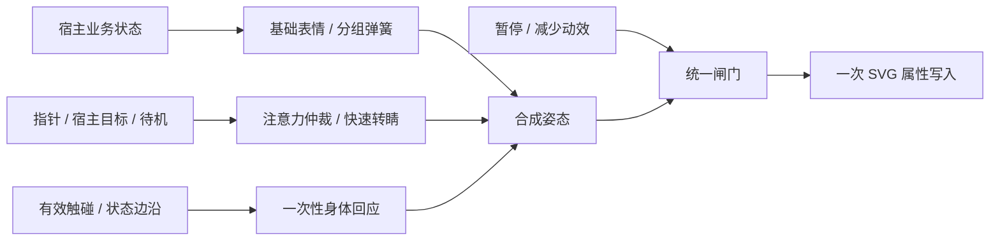

# 小星动态与性格升级方案 · 6.0.1

状态：技术与交互设计方案；2026-10-06已实施分部位弹簧、注意力、一次性回应、按压释放及正式面板动态，并完成浏览器验收。可选微扫视未启用，Android真机性能验收待补。具体实施与检查结果见 `SOUL-ORB-MOTION-UPGRADE-2026-10-06.md` 第三轮记录。以下参数表保留方案设计依据。核查日期：2026-10-06。

目标：让 44–52px 的正式聊天小球也表现出“先看到你，再转过来，碰一下会回应”的性格。保持原创 SVG、既有颜色选择、业务表情和隐私边界，沿用共享帧时钟，不新增动画运行时。

## 1. 当前代码复核：以最新实现为基线

核查文件：`src/lib/soul-orb-motion.ts`、`src/components/ui/SoulOrb.tsx`、`src/components/chat/CharacterSoulOrb.tsx`、`src/lib/soul-handoff.ts`、`scripts/verify/soul-orb-motion.mjs` 和 `scripts/verify/run-soul-orb.cjs`。

| 评审项 | 当前事实 | 本轮处理 |
| --- | --- | --- |
| W1 所有通道共用弹簧 | 表情通道和目光仍用 ω=16；身体目光跟随已有 ω=8，不能说所有部位完全同速 | 继续细分面部、身体、附件和目光，不推倒底座 |
| W2 目光像漂移 | 目光 ω=16，待机目标约每 4 秒变化一次；附近指针跟随和距离衰减已存在 | 引入快速转睛、注视停顿和输入优先级 |
| W3 三个采样器未接线 | 不成立：组件已 import 并调用 sampleOrbBlink、sampleOrbOrbit、sampleOrbTouch | 保留生产调用，增加防回归检查，不重复实施 |
| W4 表情没有预备动作 | 有效点击已有 320ms 跃起与压缩/伸展；业务表情切换仍直接改变目标，没有专属预备动作 | 给重要状态加入一次性动作，普通状态不都跳一下 |
| W5 按压能量未传递 | 当前按压目标为 scaleY×0.91、scaleX×1.07；有效点击另走固定采样回应，没有按实际压缩量传递释放速度 | 用受限释放冲量替代固定强度回应，避免两套动作叠加 |
| 场景遗漏 | 聊天头部 44px 可动画，面板打开时头部暂停；面板内 52px 明确 animated=false | 面板小球接入轻量动画，保持同时只运行当前可见主体 |

上一轮已通过的小球检查为 80 项浏览器检查、16 项数学检查；不是评审中的 72 项。本方案引用既有结果作为基线，不宣称新方案已经通过这些验收。

## 2. 成熟项目调研与采用边界

直接查阅项目维护者的源码和官方文档。原评审里的第三方 skills、转载及 kimi-cite 链接不作为参数出处。本方案的数字均为本项目调校起点，不是各库的官方推荐值。以下链接指向调研时的主分支，实施时应记录使用的提交版本；不把 star 数当作适合本项目的证据。

| 来源 | 已核实的机制 | 小星采用方式 |
| --- | --- | --- |
| [Motion spring.ts](https://github.com/motiondivision/motion/blob/main/packages/motion-dom/src/animation/generators/spring.ts) | 按阻尼比分支解析位置与速度；retarget 使用当前位置与速度；物理参数和按时长定义的模式分开 | 保留临界阻尼兼容入口，新增受限欠阻尼积分；中途换状态从当前值续接 |
| [Motion 官方 spring 文档](https://motion.dev/docs/spring) | 速度与位移阈值共同参与结束判断；提供初速度 | 定义每类通道的静止阈值，按压释放传递速度 |
| [react-spring SpringValue.ts](https://github.com/pmndrs/react-spring/blob/main/packages/core/src/SpringValue.ts) | 运动保留 lastVelocity；支持停止、即时值和不同配置 | 借鉴持续状态和显式取消，不照搬其逐毫秒积分实现 |
| [react-spring AnimationConfig.ts](https://github.com/pmndrs/react-spring/blob/main/packages/core/src/AnimationConfig.ts) | frequency 配置通过 2π/frequency 换算物理参数 | 明确本项目用 angularFrequency，单位 rad/s，不能直接抄同名参数 |
| [Rive 分层状态机](https://rive.app/docs/editor/state-machine/layers) | 多层可同时播放；同属性的层需要明确优先顺序 | 基础表情、身体回应、注意力、附件分层合成，最后统一写 SVG |
| [Rive Web 运行时 rive.ts](https://github.com/rive-app/rive-wasm/blob/master/js/src/rive.ts) | 显式停止渲染；页面隐藏取消 rAF，恢复前重置时间参考 | 保留现有暂停机制，补足未完成动作的恢复策略 |
| [Rive 距离约束](https://rive.app/docs/editor/constraints/distance-constraint) | 用距离限制对象之间的位置关系 | 借鉴范围约束，将目光合成结果限制在椭圆范围 |

不引入 Motion、react-spring 或 Rive 的运行时，不使用它们的角色素材。若实施中移植源码片段，另外核对该文件的许可及署名要求；本方案优先自行实现公开的弹簧方程和分层原则。

## 3. 小星的运动性格

主性格定为“安静、有注意力、遇到你时活泼”。平时不持续蹦跳；看见指针时眼睛先动、身体后跟；碰触有弹性；完成时轻快；失败时停一下再轻摇头，避免夸张地用交叉眼反复闪动。

| 状态 | 主要视觉行为 | 不应出现 |
| --- | --- | --- |
| idle | 小幅呼吸；不定时转睛，随后停留；偶尔连眨 | 固定每 4 秒机械巡航、持续欢呼 |
| curious | 先看目标，再侧头；一边眉毛先抬起 | 面部、身体同时到位 |
| listening | 注视相对稳定；稀疏小幅点头，保留波纹 | 每几百毫秒持续点头 |
| thinking | 视线稍上移并停留；气泡错峰变化 | 一直看左右、忙碌轨道同时抢戏 |
| working | 专注眼形；轨道光点持续工作；身体漂浮收敛 | 每次流式 token 重播入场动作 |
| happy | 嘴角先出现，眼睛随后弯起；身体轻松回弹 | 所有几何通道都欠阻尼 |
| success | 一次轻跃、笑眼和星光，然后回到稳定完成姿态 | 同一状态每次 React 渲染都欢呼 |
| surprised | 眼睛先睁大；身体略后仰，嘴再张开 | 嘴形负值、尺度被无限放大 |
| shy | 先移开目光，再缓慢侧头，腮红轻浮现 | 强烈跳跃 |
| sad / sleepy | 较慢进入，重心更低；无额外弹跳 | 带着上一状态的欢快余震 |
| error | 先停顿，轻摇两次后静止，保留失败面孔 | 循环抖动、点击后被笑脸覆盖 |

注意：小星呈现的是已有宿主状态，不新增情绪推断逻辑；“完成”只表示现有业务已确认的结果。

## 4. 引擎分层与参数

### 4.1 通道划分

新增 `orb-motion-profiles.ts`，具名配置集中定义，编译期检查每个 OrbPose 通道恰好有一个归属。

| 通道组 | 示例字段 | 起始 ω（rad/s） | ζ | 作用 |
| --- | --- | --- | --- | --- |
| 快速面部 | eyeWidth/eyeOpen/rightOpen/eyeCurve、brow/browLift/browTilt | 26 | 1 | 先表达意图 |
| 嘴部 | mouthWidth/mouthCurve/mouthOpen/mouthDark | 20 | 1 | 略晚跟上眼睛 |
| 面部位置 | eyeGap、faceX/faceY | 22 | 1 | 保持表情结构稳定 |
| 身体基础 | tilt、scaleX/scaleY、lift | 14 | 1 | 身体有重量 |
| 附件显隐 | blush、orbit、orbitDot、listening/thought/busy/sleep/tear/cross/sparkles | 18 | 1 | 不弹出负透明度或半径 |
| 主目光 | gazeX/gazeY | 40–45 | 1 | 快速转睛 |
| 身体追随 | bodyGazeX/bodyGazeY | 9–11 | 1 | 眼睛领先身体 |
| 开心/完成一次性身体偏移 | 独立 accentScale/accentTilt/accentLift | 22–26 | 0.78–0.85 | 轻微、有界回弹 |
| 低落/困倦身体基础 | 只覆盖身体组 | 7–9 | 1 | 更慢、更沉 |

快速面部与嘴部通常不加人工 delay；不同弹簧本身产生先后。惊讶的嘴部可采用一次 30–45ms 的预备阶段，不依赖 setTimeout。

以上稳定时间必须实际采样验证，不能只由 ω 推断“320ms 完全停止”。低落慢过渡建议允许 500–800ms；这是对先前统一 320ms 口径的明确例外，只用于角色姿态，不延迟操作。若版本要求严格禁止该例外，使用 ω≈16 的身体过渡，通过重心与幅度塑造沉重感。

### 4.2 物理实现

现有 `settleOrbValue` 保持原签名和结果，作为 ζ=1 的兼容入口。新增 `stepOrbSpring(value, velocity, target, dt, profile)`，初期只接受 ζ=1 与 0.75≤ζ<1，不为本轮扩展任意过阻尼。

欠阻尼使用解析解，令 y=x−target、a=ζω、b=ω√(1−ζ²)、B=(v+ay)/b：

```text
y' = exp(-a·dt) · [y·cos(b·dt) + B·sin(b·dt)]
v' = exp(-a·dt) · [v·cos(b·dt) - (a·B+b·y)·sin(b·dt)]
x' = target + y'
```

ζ接近1走原临界阻尼分支，避免除以趋零的 b。对非有限输入、dt<0、ω≤0等异常采用明确校验与安全静态结果。正常动画不中途重置速度。配置切换与目标切换从当前 x、v 接管。

不要把 ζ=.75 理解为“球体自动超过最终尺度 3%”：零初速阶跃的过冲约为此次变化量的 2.8%，不是最终尺度的 2.8%。如果基础 scaleY 只变化 .03，其过冲几乎看不见。因此完成动作的可见 2–4% 伸展来自单独的身体偏移层，幅度明确设计和测试。

附件透明度、眼睛开合、嘴开度都保持临界阻尼。渲染仍有几何安全范围，但不依靠每帧硬截断来掩盖失控弹簧。进入低落时投影掉会把身体继续带向旧开心目标的速度，保证慢过渡不继承欢快余震；该阻尼处理不改变当前画面位置。

### 4.3 合成顺序



眼睛只由基础眼形与眨眼合成，目光只改变 face 位置；身体层不写眼睛路径。欢呼不能覆盖 thinking/working/error/success 的真实表情。小球和 soul-handoff 飞行外层分别拥有内外 transform，不能互相覆盖。

## 5. 注意力与转睛

### 5.1 指针与漫游

桌面连续指针跟随用 ω≈32，待机目标或宿主目标的跳变用 ω≈45；实现的是有生命感的快速转睛，不宣称精确模拟生物眼球。

待机不再固定 4 秒换点：先以 1.8–4.5 秒的有界随机间隔选择附近小目标，注视停留至少 700ms。横向幅度约±.30，纵向±.12；大多数目标靠近中性，不不断扫到极边。

微扫视先作为可调试选项：目标处停留时，稀疏加入≤.02的短偏移，不用连续正弦抖眼。36–52px 默认关闭它，因为用户看不清但渲染仍有成本。

合成后采用椭圆约束，避免 x/y 分别 clamp 后在对角方向产生过大的总位移。当前 SVG 表情以整体脸部位移为主，不新增瞳孔和眼白，以免改变品牌形象。

### 5.2 眨眼联动

继续只用已接线的 sampleOrbBlink（65ms闭合、145ms张开）。大转睛阈值建议归一化位移>.6；只有离散转睛触发联动，连续 pointermove 不逐事件触发。距上次眨眼至少700ms，正在眨眼时不重开。

自然连眨概率由当前18%下调至约10–12%，两次间隔80–110ms；困倦和已有闭眼表情不强行加眨眼。所有时间用暂停可控的动画时钟，不添加长驻定时器。

### 5.3 宿主注意力 API

建议新增可选、纯视觉参数：

```ts
type OrbAttention = {
  key: string;                    // 视觉目标身份，避免同一目标不断重触发
  point: { x: number; y: number };// 小球局部归一化坐标，非页面像素
  expiresInMs?: number;           // 默认 1200，最长 2000
};
// SoulOrb 的新参数：attention?: OrbAttention
```

优先级：有效且在附近的指针 > 未过期宿主目标 > 待机漫游。远处指针不能一直压住宿主目标。触控只在有效按压/移动期间取得指针优先权，松手后交还；取消滑动不额外欢呼。键盘激活直接给中心注意力和合法回应。

宿主第一批仅接两个地点：助理完成任务时看向刚完成事项、聊天开始生成时看向消息区域。目标只取可见位置，不包含文本，不依赖生成 token。开始/完成边沿更新一次，不逐 token 重设。

现有 soulKey 注册表服务于共享元素飞行，不能直接假定它已注册任务行。首版由宿主持有元素 ref，在业务事件、滚动/resize/visualViewport 变化时更新位置；渲染循环不读 DOM。无目标、离屏、切换账号/角色/会话、嵌套弹层遮挡或目标卸载时立即失效。之后有明确复用场景再考虑独立注意力注册表，避免把飞行注册表改成全局业务总线。

## 6. 重要状态的一次性动作

配置表只为“进入重要状态”的边沿触发；初次挂载直接画当前表情，不重播历史成功或失败。重复相同 emotion 不重启。宿主若要表达第二次成功，另提供可选 cueId，采用已有 reaction 类似的事件身份机制。

| 过渡 | 预备 | 主动作 | 结束及范围 |
| --- | --- | --- | --- |
| 任意→success | 40–60ms，身体轻压缩约2% | 轻跃，身体伸展2–4%，星光一次增强 | 320ms内身体回应归零；完成表情继续保持 |
| 任意→error | 35–50ms，身体收稳；面部立即给失败信号 | 120–220ms轻摇两次，约±3°，递减 | 280–320ms静止，不循环 |
| idle→curious | 不额外压缩 | 眼睛先转，身体随后侧头 | 无固定等待时间，允许立即反向 |
| 任意→surprised | 30–45ms轻收缩 | 眼睛先大、身体后仰、嘴跟上 | 限制姿态范围，回应≤320ms |
| 任意→sad/sleepy | 不做反向弹跳 | 身体缓慢降低重心 | 500–800ms软姿态过渡；见时长例外 |
| thinking↔working | 无预备 | 面部和附件分组切换 | 不反复摇晃，不影响输出 |

一次性偏移层与基础弹簧分开。新状态到来时取消尚未开始的预备，但从当前偏移位置/速度回收；不能直接把偏移清零造成跳帧。发生 error 时优先终止 success 的欢呼，把残余动量吸收后转入失败动作。

过去“所有动作都加70–90ms预备”的建议不采用：44px头部会感觉迟钝，错误提示也不能延迟。重要信息先在面部体现，身体预备只作为陪伴反馈。

## 7. 按压能量与释放

视觉按下保留约7%横向展开、9%纵向压缩上限。压力不随按住时长无限增长，释放强度取实际到达的压缩量，因而轻点和充分按压自然不同。

令 c=clamp(基础scaleY−当前scaleY,0,.09)，合法释放时向独立身体回应层注入 vY≈clamp(10c,0,.9) scale/s；横向注入相反、较弱的速度。这个数值是起始配置，最终以36/44/52/160px录像定标。抬起手指不直接改基础表情的所有通道速度。

必须由 SoulOrbButton 的合法激活判定提交释放：当前 window pointerup 在 click 之前执行，不能在任意 pointerup 直接加冲量，否则滑动取消也会蹦。pointerup 只记录候选，成功 click/reaction 才消费；外部宿主同样遵守契约。键盘激活使用固定的小幅冲量。

取消、>10px移动、滑出按钮、pointercancel、窗口失焦或页面隐藏，只回收压缩，完全不跳。再次按下正在回弹的小球，接管当前位置与速度并耗散向外的运动；不同时叠加旧 sampleOrbTouch 和新释放冲量。sampleOrbTouch 可保留为兼容模式/纯采样测试，但生产每次回应只能有一个驱动源。

## 8. 正式界面的动态策略

| 场景 | 尺寸 | 行为预算 |
| --- | --- | --- |
| 普通聊天/助理头部 | 44–48px | 待机呼吸+眨眼；快速转睛；主要状态附件与一次性回应 |
| 状态与互动面板 | 52px | 面板打开后启用轻量动画；底下头部继续暂停；嵌套档案/故事打开时再次暂停 |
| 流式消息装饰 | 极小 | 仅简单工作律动，不启用全局指针跟随、眉毛预备和微扫视 |
| 空态 | 80–100px | 降低频率，保留一次入场后的安静待机 |
| 独立预览/展示 | 160px以上 | 完整层次，用于评审，不据此判断手机小尺寸达标 |
| 颜色设置、表情缩略图 | 静态 | 保持 animated=false，不因升级全面开动 |

策略只选择幅度与允许的层，不更改 emotion 的业务含义。全局选色与角色默认配色继续消费原有 CSS 变量。深浅色只调光影对比，不让浅色的小球变成另一种运动性格。

## 9. 工程拆分、性能与降级

拟新增纯逻辑 `orb-motion-profiles.ts` 和 `orb-attention.ts`；继续由 `soul-orb-motion.ts` 管理共享时钟、积分和采样，SoulOrb.tsx负责ref、生命周期和SVG提交。没有第二个rAF时钟，不引入 Zustand 的逐帧状态。

每个通道组的相同ω/ζ/dt只计算一次积分系数，再应用到本组通道；优先减少每帧数组和临时对象分配。保存上次写入值，对已静止的表情路径跳过相同 d 属性写入；呼吸/眨眼仍需时钟，但不必每帧重写不变的嘴、眉及隐藏附件。几何属性变化会触发SVG重绘，不能把它描述成“全部仅合成层”。

减少动效下直接给最终业务表情：无漂浮、眼跳、摇头、跳跃、轨道旅行，注意力不位移，颜色可正常更新。animated=false保持相同静态策略。不可见、失焦、隐藏、应用后台停止订阅；清空触摸、注意力和一次性动作，恢复时不补播过去的成功/失败，呼吸幅度重新淡入。

在1/2/4个可见小球分别测量脚本耗时和重绘范围，不以桌面rAF间隔推断AndroidGPU帧率。目标：对照当前版本，双球活跃场景无持续长任务、无新帧内React提交；真实设备目标为小球脚本p95≤2ms/帧且整页不显著退化，未实测前只写目标。无新运行时依赖；新增JS gzip预算建议≤3KB，CSS不新增持续光效，仍满足全站CSS基线+15%的约束。

## 10. 可执行验收

### 数学检查：扩展 soul-orb-motion.mjs

1. 临界阻尼兼容结果与现有函数一致；欠阻尼在30/60/120Hz及不均匀dt下，对同一静态目标的最终值/速度一致到数值容差。
2. ω/ζ边界、dt=0、异常输入、接近临界阻尼无NaN/Infinity；参数与单位覆盖。
3. 从静止开始的低落身体过渡无过冲，90%完成时间至少400ms，1%位置误差进入时间至少500ms；额外覆盖从happy的非零速度切入低落。
4. 目光静止目标跳变，归一化误差降到初始幅度10%以内≤200ms；不把连续移动目标拿来测固定目标到达时间。
5. success身体偏移峰值为.02–.04（相对基础scaleY的可见变化），320ms动作包络归零；基础表情的位置与速度在600ms内进入配置静止阈值。评估时排除呼吸，不直接从最终SVG总矩阵推断弹簧过冲。
6. 按压冲量单调随实际压缩量增加、有上限；连续触碰不累计能量；取消路径无正向释放冲量。
7. 所有状态快速切换，嘴/眼/尺度/附件都保持有效几何和有界值；中途接管位置连续。

### 浏览器检查：扩展 run-soul-orb.cjs / run-character-orb.cjs

1. 左到右大转睛触发一次眨眼，200ms内出现闭合；连续pointermove不重复打断眨眼。
2. 指针、宿主目标、漫游优先级及过期时间；远处指针交还宿主；滚动/键盘视口改变后注视基准正确。
3. touchcancel、滑出、>10px移动、失焦不跳；合法点击/Enter/Space只激活一次，业务动作不等待动画。
4. success重渲染不重播，新的cueId可再次回应；working每个token不重新入场；错误覆盖成功时无突跳。
5. 面板打开时52px球动态，44px头部暂停；嵌套弹层、关闭返回和账号/角色/会话切换不会保留注意力或旧cue。
6. 两套主题×320/390/430px；重点录制44/52px，而非只截160px大球。真实3种使用颜色核对光影，表达不依赖颜色才能区分。
7. 系统/应用减少动效、animated=false、视口外、后台、失焦均停止时钟；恢复不补播，双球无逐帧React提交。

### 人工视觉验收

交付8–12秒对照录像：待机→指针靠近→合法按压→拖出取消→忙碌→完成→失败→减少动效。每种主题至少一份44/52px正式界面录像；附60Hz普通AndroidWebView和一台较低性能设备的帧时间记录。静态截图用于形态、裁切和颜色验收，不能单独证明“更顺滑”。

## 11. 实施次序与交付

| 阶段 | 工作 | 完成条件 | 估计工作量 |
| --- | --- | --- | --- |
| A | 纯数学欠阻尼、通道归属和配置；现有采样器防回归 | 数学检查全绿，无视觉改动即可独立验收 | 0.5–1天 |
| B | 快慢分层、快速转睛、眨眼联动；面板52px动态策略 | 正式44/52px录像可辨眼先身后；暂停检查通过 | 1天 |
| C | 完成/失败一次性动作、按压能量及中途接管 | 取消不跳、状态不被覆盖、320ms回应边界通过 | 1–1.5天 |
| D | 注意力API并接两个宿主场景 | 事件边沿触发、目标失效及隐私隔离通过 | 0.5–1天 |
| E | 属性写入优化、视觉/真机回归、体积入档 | 既有回归及新增检查通过，性能有记录 | 0.5–1天 |

约3.5–5.5个工作日，为单人实现与验收的估计，不是承诺期限。最小高收益集为A+B+C，先让用户接触的小球有不同部位节奏、有注意力、有合法触碰弹性；注意力API可随后落地。微扫视、更多特殊过渡和参数设置页暂缓，避免增加用户配置负担。

更新原 `SOUL-ORB-MOTION-UPGRADE-2026-10-06.md` 的实施记录应在每阶段实际完成后进行，记录验证命令、源码版本、体积和未完成真机项。本文件负责方案，旧文件继续负责已实施事实，防止再次出现“方案里的功能被误认为已经接线”。
